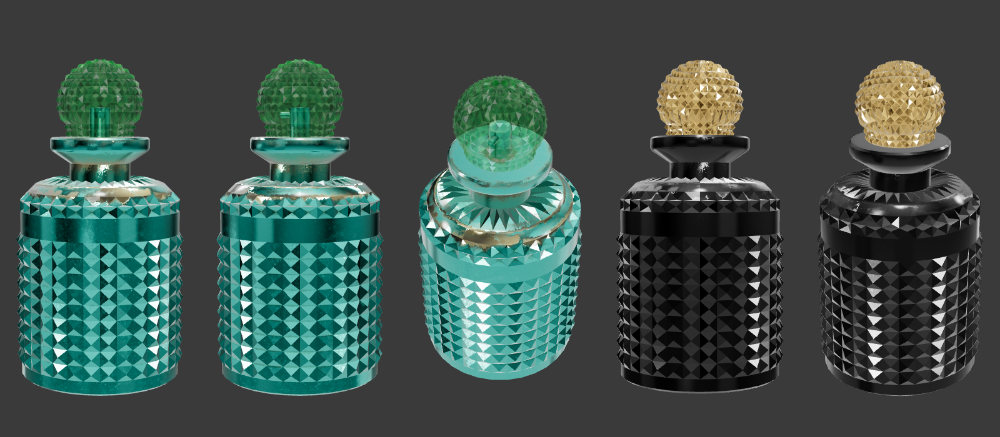

# NOIRÉ — 3D Bottle Model Inspection & True-3D Scene Plan

> Status: **INSPECTION COMPLETE. Nothing built. Awaiting approval.**
> Source: `perfume_bottle.zip` → `scene.gltf` + `scene.bin` + 6 textures

*Left 3: the original model as shipped (front, side, high 3/4). Right 2: a 20-second recolour test (black body, gold stopper). No lighting work, just proof the materials take new values.*

---

## 1. Does it load? — ✅ Yes

Loaded with `three/examples GLTFLoader` (the same loader drei's `useGLTF` wraps) in headless Chromium. No errors from the model. (The only 404 was the browser's automatic `/favicon.ico` request on the test page.)

| Property | Value |
|---|---|
| Format | glTF 2.0 (Sketchfab export, generator 15.66), JSON + external `.bin` |
| Geometry size | `scene.bin` 712 KB |
| Meshes | **2** |
| Triangles | 3,254 (body) + 1,504 (stopper) = **4,758 total** (very light) |
| Vertex attributes | position, normal, **tangent**, uv0/uv1/uv2 (identical sets) |
| Extensions | `KHR_materials_clearcoat`, `KHR_materials_specular`, `KHR_materials_transmission`, all supported natively by three's `MeshPhysicalMaterial` |
| Textures | 6 × **4096² PNG = 25.4 MB** (must be optimised, see §5) |

## 2. Orientation, scale, pivot

- **Up axis:** Y-up after the node chain (Sketchfab root `-90° X` + FBX `0.01` scale + the mesh `100×` scale cancel out cleanly). It loads upright with no correction.
- **World bounds:** X/Z ±0.194, Y **-0.183 → +0.549**
  - Height **0.732 u**, diameter **0.387 u**, aspect **1.89 : 1** (squat apothecary flacon, not a tall column)
- **Pivot:** at the **body's centre**, *not* the base. The base sits 0.183 below the origin. → Wrap in a `<group>` that offsets y +0.183 and normalises to **height = 1.0 u**, so our camera plan's "1 unit = bottle height" holds exactly.
- **Front:** the body is **rotationally symmetric** (16 stud columns repeating). Only the stopper's small rod and the label we add will define a "front". This is good news for 360° rotation: there's no "bad side".

**Vertex height profile (body mesh, 40 bins)** shows clean geometric bands:

| World Y | Part |
|---|---|
| -0.183 → 0.174 | Studded body (alternating 128/256 vertex rows = stud rows) |
| **0.174 → 0.21** | **Smooth band** (0 vertices mid-band). This is our **label surface.** |
| 0.21 → 0.29 | Studded/radial shoulder |
| — **0.302: zero vertices** — | **Clean cut point** |
| 0.32 → 0.34 | Neck |
| 0.375 | Collar seat |
| 0.41 → 0.45 | Flared collar disc + centre rod |
| 0.372 → 0.549 | Stopper sphere (separate mesh) |

## 3. Materials

| Mesh | Material | As shipped | Notes |
|---|---|---|---|
| `Cylinder_Material.001_0` (body + shoulder + neck + collar disc + rod) | `Material.001` | Physical; **metalness 1** (from the map, so it's modelled as *metal*, not glass), teal base colour with **bronze patina** worn into the shoulder rim, normal map (scratch/wear detail), clearcoat 1.0 / 0.04, specular 0.16, double-sided | The teal colour lives entirely in `baseColor.png`. The factor is white, so dropping the map fully frees the colour. |
| `Sphere_Material.003_0` (faceted stopper) | `Material.003` | Physical; **transmission 0.67**, alpha BLEND, green base factor `#07D90D`-ish × texture, clearcoat 0.93 / 0.0, normal map (fine noise) | Transmission = one extra render pass. It only covers the small stopper, so it's affordable. |

The texture contents (I viewed all six) are UV-unwrapped stud patterns. The *facets themselves are real geometry*, not normal-map fakes, so close-ups will hold up.

## 4. Are cap and bottle separate meshes? — ⚠️ Partly

- **Stopper sphere: separate mesh** ✅ It can rotate, lift, catch light and be highlighted independently.
- **Collar disc + rod + neck: fused into the body mesh** ❌ …but the height profile has a **zero-vertex gap at y = 0.302**, so a triangle-centroid split separates them cleanly. *Verified in the right-hand test renders:* the flared disc + rod come away as their own mesh (gold in the test), and the black body is left intact with no torn faces.
- Plan: do the split **once, offline**, with a small `gltf-transform` script (not at runtime). It outputs `noire-bottle.glb` with **3 named nodes**: `Body`, `Collar`, `Stopper`. The geometry is untouched: same vertices, same UVs, only re-partitioned.

## 5. Can materials be recoloured safely? — ✅ Yes

Proven in the test render: `map = null` + new `color`/`metalness`/`roughness` gives a clean result with no texture artefacts. Details:
- Keep each mesh's **normal map** (at reduced `normalScale` ~0.35) so the glass keeps micro-wear and doesn't look CG-perfect.
- **Drop** both base-colour maps (the teal/green identity) and the stopper's 12.8 MB metallic-roughness map.
- Re-purpose `Material.001_baseColor`'s **bronze patina channel** as an optional mask for *worn gilt* on the shoulder rim. I'd test it, but not commit to it: it could read antique rather than modern-luxe.
- **Texture budget:** 25.4 MB → resize to 2048² (desktop) / 1024² (mobile), encode **KTX2 (UASTC normals, ETC1S rest)** or WebP. Target **≤ 2.5 MB total**. Geometry compressed with Meshopt (712 KB → ~150 KB).

## 6. Transforming it into NOIRÉ

| Part | NOIRÉ material | Settings (MeshPhysicalMaterial) |
|---|---|---|
| **Body** | **Obsidian / black lacquered glass.** Opaque, deep, all character from reflections. | color `#060606`, metalness 0, roughness 0.06, **clearcoat 1 / 0.02**, ior 1.52, specularIntensity 1, envMapIntensity 1.1, normalScale 0.35. The 16×10 **stud facets become hundreds of tiny mirrors**; a moving light makes them **glint row by row**. That's our signature effect. |
| **Collar** (split mesh) | **Brushed muted gold** (not yellow, not chrome) | color `#B8955A`, metalness 1, roughness 0.28, **anisotropy 0.5** (circumferential brushing), envMapIntensity 1.3 |
| **Stopper** | **Smoked champagne crystal**: a transmissive faceted jewel that refracts the scene | transmission 1, thickness 0.15, ior 1.6, **attenuationColor `#5A3B1A`**, attenuationDistance 0.12, roughness 0.02, **dispersion 0.12**. *Fallback (mobile/low tier):* opaque gold-smoked facets, no transmission (like the right-hand test render). |
| **Label** (new, no geometry change) | **Gold-foil engraving "NOIRÉ"** wrapping the smooth band at y 0.174–0.21 | Implemented as a cylindrical-UV **mask texture** (SVG → canvas) that switches the band locally to gold metal + slight emission. Its visibility is a uniform `uLabelReveal`, so it can be **readable last**, as briefed. The band is 4.8% of the bottle's height: at an 80 vh hero that's ~40 px tall, a jeweller's-engraving scale, which is classy rather than loud. |

**Brand fit:** a studded black-glass flacon with a gold collar and smoked crystal stopper reads as **noir haute-parfumerie**, close in spirit to a jewelled decanter. The studs are a gift: lighting choreography becomes visible on every facet.

## 7. Attribution (CC-BY-4.0, required)

> This work is based on "perfume bottle" (https://sketchfab.com/3d-models/perfume-bottle-2318f02b3bfb4587bc6e50ea768b4e77) by milaha (https://sketchfab.com/elenakozlova479) licensed under CC-BY-4.0 (http://creativecommons.org/licenses/by/4.0/).

Will be kept in: `public/models/LICENSE-bottle.txt` (verbatim `license.txt`), `README.md` → Credits, and a visible **"Credits"** line in the site (a small link in the UI corner during Scene 1, and later in the footer). CC-BY allows modification (recolour/split) as long as changes are indicated. The credit line will say "modified: materials recoloured, collar separated".

---

## 8. Updated scene plan — TRUE 3D

The structure from the approved analysis stays. The image-era restrictions (±5° turn, 2.5D) are **lifted**. One persistent R3F `<Canvas>`, one `CameraRig`, one bottle instance travelling through every scene. Bottle height = 1 u, base at y = 0.

| # | Scene | Pin | Camera | Bottle | Light story |
|---|---|---|---|---|---|
| 1 | **The Stage / Hero Reveal** | load-timed 2.4 s, then 100 vh hold | Dolly from z 4.2 → 3.3 (power3.out, 2.4 s), pitch 0 → -2° | On the plinth, floating 0.04 u. rotY -25° → -8° during the reveal (**real turn, so the facets sweep light across**), scale 1. Desktop x +0.32 (right of centre). | Lamp → gold rims → front fill → plinth glow → **label engraving last** |
| 2 | **Colour Flood + Dolly-In** | 120 vh | z 3.3 → 1.9, crane down to pitch -10° (low angle), FOV 35 → 32 | rotY -8° → +20°, rotZ 0 → +6°. Plinth + lamp drop away. | Background floods from the bottle's screen position: studio black → amber radial `#3A2614`. Strong right rim. |
| 3 | **Top Notes** — Bergamot · Pink Pepper · Saffron | 120 vh (shared 360 vh pin, snapped) | **Orbit up** to pitch +12°, target the **stopper** (y 0.92) | rotY +20° → +140° (**real rotation**). The stopper turns *independently* +30°. | **Light-scan on the stopper**: the crystal refracts a hot amber point light. Hue `#3A2614`. Top notes = top of the bottle. |
| 4 | **Heart Notes** — Rose · Jasmine · Oud | 120 vh | Orbit down to eye level, target the **label band** (y 0.52) | rotY +140° → +260° | A horizontal **scan band of light sweeps the band/shoulder**: stud row glints + gold engraving catches. Hue → oxblood `#3A1418`. |
| 5 | **Base Notes** — Amber · Musk · Sandalwood · Vanilla | 120 vh | Orbit to a low angle (pitch -14°), target the **base** (y 0.15) | rotY +260° → +360° (completes the **full 360°**) | Scan band lights **the lower stud rows + floor reflection**. Hue → resin `#1C140C`. |
| 6 | **Smoke Interlude** | 120 vh | Pull back to z 3.1, eye level. DOF on the bottle. | rotY drift +4°, upright | Back-lit warm smoke. Giant blurred "L'HEURE NOIRE" behind the bottle. Soft front key so the label reads. |
| 7 | **Material / Glass Macro** | 160 vh | **Macro fly-in**: z → 0.55, FOV 26, orbit 40° around the shoulder → up to the collar → into the stopper | Slow rotY +25° | Area-light sweep travels **down the facets** (row-by-row glint cascade), then across the **brushed gold collar** (anisotropic streak), then **through the crystal stopper** (dispersion). |
| 8 | **Signature Bottle Finale** | 120 vh | High-angle orbit (pitch +18°) circling **360° around** the bottle (camera orbit, not product spin) | Static, floating, idle bob | World-fixed key + rims, so the orbiting camera shows reflections travelling. Diagonal light shaft. |
| 9 | **CTA / Purchase** | 100 vh | Returns **exactly to Scene 1's framing** (bookend) | Back on the plinth, rotY -8° | Lamp + plinth re-cue (flicker 1 → 0.7 → 1). "FIND YOUR SIGNATURE SCENT." + Discover/Shop CTAs. |

### Architecture (so scenes stay one journey)
- `src/three/Bottle.jsx` loads the GLB and owns materials. It exposes refs + uniforms (`uLabelReveal`, `uScanY`, `uScanIntensity`, `uRimGold`), so any scene can drive it.
- `src/three/CameraRig.jsx` handles keyframes (position / target / FOV) with Catmull-Rom interpolation and critically damped follow. It's driven by **one** GSAP master timeline (time-based for the intro, ScrollTrigger-scrubbed after). No per-frame React state: GSAP tweens plain objects that `useFrame` reads.
- `src/three/Lighting.jsx` holds the named lights (lamp, rimL, rimR, fill, plinthGlow, sweep), each with intensity tweened by the timeline.
- `src/three/Stage.jsx` holds the plinth, background shader quad (vignette + flood + haze), and the low-poly smoke sprites.
- Quality tiers (`high` / `low`) toggle stopper transmission, DOF, haze layers and DPR cap (1.75 / 1.25).

### Proposed build order
1. Offline prep script: split → recolour-ready GLB → KTX2/Meshopt → `public/models/noire-bottle.glb` (≤ 3 MB)
2. **Scene 1 only**, as briefed (stage, light sequence, dolly, copy, responsive, validation screenshots)
3. Stop for approval

### Risks specific to this model
1. **The studs can alias/shimmer** during rotation at 1× DPR. Mitigation: MSAA 4 + DPR ≥ 1.5 on desktop, and a slightly higher roughness (0.06 → 0.09) on mobile.
2. **Small label band** (4.8% of height). Readable at hero scale, not at small mobile sizes. On mobile Scene 1 the bottle is ≥ 55 vh, so the band is ~22 px tall, which is borderline. Fallback: the engraving is gold and lit last, but the headline carries the brand name anyway.
3. **Obsidian body = reflections only.** The quality of the environment map *is* the quality of the bottle. I'll build a custom studio environment inside R3F (drei `<Environment>` with `<Lightformer>` strips: tall vertical softboxes + a top disc), not a generic HDRI, so the reflections spell out our lighting design.
4. Headless screenshot validation uses SwiftShader (software GL). Fine for composition/timing, but slower and not representative of real-device frame rates.

---

### Please confirm
1. **Materials:** obsidian body + brushed muted-gold collar + **smoked champagne crystal** stopper. *(Alternative: solid faceted gold stopper.)*
2. **Label:** gold-foil "NOIRÉ" engraving on the smooth band, revealed last.
3. **Attribution placement:** small "Credits" link visible in Scene 1's UI corner + README.
4. The updated 9-scene true-3D plan above.

On approval I'll run the model-prep step and build **Scene 1 only**.
